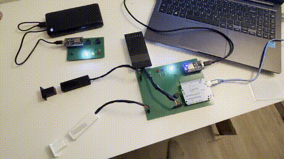
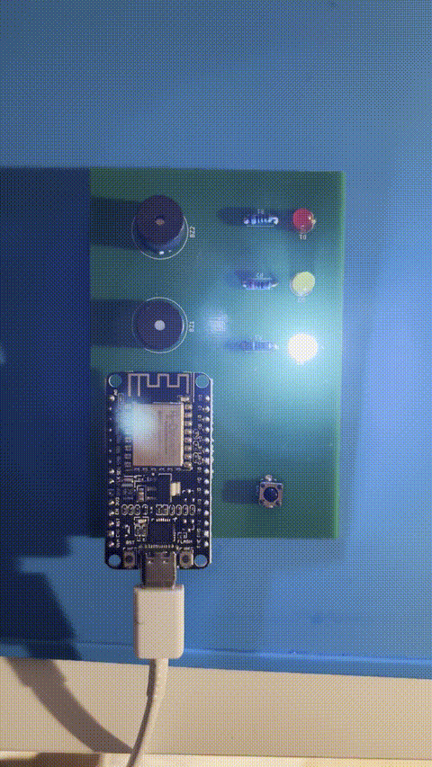

# IoT-Basis-Alarmanlage / IoT Basic Alarm System

**Kurzbeschreibung / Brief Description:**  
IoT-Alarmanlagen-Basissystem auf ESP8266 und Elegoo Uno R3-Basis mit magnetischen Hall-Sensoren (KY-021) und RFID-Zugangskontrolle (RC522). Das System verarbeitet Sensordaten lokal, steuert Ausgaben wie LED und Buzzer, kommuniziert über UART und UDP und ist modular erweiterbar. Ein webbasiertes Monitoring-Dashboard auf Raspberry Pi Zero 2 W ermöglicht Echtzeit-Überwachung, Fernsteuerung und Telemetrie-Analyse aller Nodes. Ziel ist ein praxisnahes Embedded-/IoT-Projekt eines Studierenden der THGA Bochum.

Basic IoT alarm system based on ESP8266 and Elegoo Uno R3, featuring magnetic Hall-effect sensors (KY-021) and RFID access control (RC522). The system processes sensor data locally, controls outputs such as LEDs and buzzers, communicates via UART and UDP, and is designed for modular expansion. A web-based monitoring dashboard on Raspberry Pi Zero 2 W enables real-time monitoring, remote control, and telemetry analysis of all nodes. This project serves as a hands-on Embedded/IoT application developed by a student at THGA Bochum.

<div align="center" >
  <a href="#">
    
  </a>
  <a href="#">
    
  </a>
</div>

---

[](docs/lessonsLearned.md) [](web/) [](firmware/elegoo_uno_r3) [](firmware/esp8266_nodes/sketch_empfaengerESP) [](firmware/esp8266_nodes/sketch_senderESP/) [](hardware/pcb/r3_senderEsp/schaltplan_r3_senderEsp.png) [](hardware/pcb/empfaengerEsp/schaltplanEmpfaenger.png) 

---

## Inhaltsverzeichnis
- [Übersicht / Overview](#übersicht--overview)
- [Systemarchitektur / System Architecture](#systemarchitektur--system-architecture)
- [Web Dashboard / Monitoring Interface](#web-dashboard--monitoring-interface)
- [Firmware](#firmware)
- [Hardware](#hardware)
- [Projekt-Highlights / Features](#projekt-highlights--features)
- [Mechanik / Mechanical Design](#mechanik--mechanical-design)
- [Zusammenbau / Assembly](#zusammenbau--assembly) 
- [Reflektion / Lessons Learned](#reflektion--lessons-learned)
- [Status](#status)
- [Hinweis / Notes](#hinweis--notes)
- [Verwendete Tools / Tools Used](#verwendete-tools--tools-used)

---

## Übersicht / Overview
Dieses Projekt ist eine selbstentwickelte Basis-IoT-Alarmanlage mit zwei ESP8266-Nodes und einem Elegoo Uno R3.  
Es dient als modularer Grundbaustein, der es ermöglicht, bei Bedarf weitere Nodes hinzuzufügen und das System so flexibel und einfach zu erweitern.
Es umfasst Sensorerfassung, Kommunikation (UART & UDP) zwischen den Nodes, eine zentrale Steuerungseinheit sowie selbst entworfene PCBs.  
Ein Web-Dashboard auf Raspberry Pi Zero 2 W ermöglicht die Echtzeit-Überwachung, Fernsteuerung und detaillierte Telemetrie-Analyse aller Systemkomponenten.
Für die Sensoren wurden 3D-gedruckte Gehäuse verwendet.  
Dies war mein erstes praktisches Embedded-System-Projekt, umgesetzt mit minimaler Vorerfahrung im ersten Semester.  

This project is a self-developed basic IoT alarm system using two ESP8266 nodes and an Elegoo Uno R3.  
It serves as a modular foundation, allowing additional nodes to be integrated as needed, making the system flexible and easily expandable.
It includes sensor data acquisition, communication (UART & UDP) between nodes, a central control unit, and custom-designed PCBs.  
A web dashboard on Raspberry Pi Zero 2 W enables real-time monitoring, remote control, and detailed telemetry analysis of all system components.
3D-printed housings were used for the sensors.  
This was my first hands-on embedded systems project, developed with minimal prior experience during my first semester.

---

## Systemarchitektur / System Architecture
- Zwei ESP8266-Nodes zur Kommunikation / Two ESP8266-Nodes for communication
- Elegoo Uno R3 als zentrale Steuerung / Elegoo Uno R3 as central controller
- Raspberry Pi Zero 2 W als Monitoring-Server / Raspberry Pi Zero 2 W as monitoring server
- Selbst entworfene PCBs / Custom designed PCBs
- 3D-gedruckte Gehäuse / 3D-printed housings

[](hardware/pcb/r3_senderEsp/rückseite_r3_senderEsp.png)  [](hardware/pcb/empfaengerEsp/rückseiteEmpfaenger.png) [](media/photos/gehauesePrototyp.png) [](mechanics/3d_prints/receiving_pcb/EmpfaengerGehaeusePCB.jpg)


**Workflow / Ablauf:**  
Der folgende Workflow zeigt, wie Sensoren und Aktoren über die Steuerungseinheit und ESP-Nodes interagieren.  
The following workflow shows how sensors and actuators interact via the control unit and ESP nodes.

```
                              LED + Buzzer        
                                   ↑ 
         RC522 + KY-021 →  Elegoo Uno R3 (Alarm-Logik)              ←           USB
                                   ↓                                             
                             UART (9600 baud)                                    ↓
                                   ↓                                             
                             ESP8266 Sender   ←   MQTT/HTTP/JSON API   →   Raspberry Pi Zero 2 W 
                                   ↑                                             
                                 (UDP)                                           ↑
                                   ↓                                             
                           ESP8266 Empfänger             ←                MQTT/HTTP/JSON API  
                                   ↓                    
                              LED + Buzzer         
```

---

## Web Dashboard / Monitoring Interface

Ein Ki-Assisted selbstentwickeltes, professionelles Web-Dashboard ermöglicht die zentrale Überwachung und Steuerung aller Systemkomponenten. Das Dashboard läuft auf einem Raspberry Pi Zero 2 W und bietet eine moderne, responsive Benutzeroberfläche für Desktop und Mobile.

A Ki Assisted-developed professional web dashboard enables central monitoring and control of all system components. The dashboard runs on a Raspberry Pi Zero 2 W and provides a modern, responsive user interface for desktop and mobile devices.

[](web/)

---

### Dashboard-Features

#### Echtzeit-Überwachung / Real-time Monitoring
- Live-Status aller ESP-Nodes mit farbcodierten Indikatoren und Puls-Animation
- Automatische Aktualisierung alle 2 Sekunden (konfigurierbar)
- IP-Adressen-Anzeige für alle verbundenen Geräte
- Online/Offline-Erkennung mit Timeout-Überwachung (15 Sekunden)

#### Geräte-Steuerung / Device Control
- Remote Reboot und Reset für alle ESP8266-Nodes
- Alarm Ein/Aus Toggle für Empfänger-Node mit visueller Bestätigung
- PiCam Stream-Integration (Raspberry Pi Camera Module)
- Video-Aufzeichnung bei Alarm-Events (Raspberry Pi Camera Module) + Automatische Speicherung mit Zeitstempel
- Befehlsausführung mit Bestätigungsdialog

#### System-Diagnose & Telemetrie / System Diagnostics & Telemetry
- WLAN-Signalstärke (RSSI) und RAM-Auslastung (Heap) Monitoring
- Geräte-Status-Tabelle mit Uptime, Reset-Grund, Freier RAM
- Interaktive Charts mit historischen Daten (100 Datenpunkte)
- CSV-Export für Telemetrie-Daten

#### Live-Kommunikationslogs / Live Communication Logs
- Separate Terminal-Ansicht für jeden Node
- Echtzeit-Anzeige von UART/UDP-Kommunikation
- Farbcodierte Log-Einträge für bessere Lesbarkeit
- Scroll-to-Bottom-Funktion für neue Nachrichten
- Clear-Funktion für einzelne Logs

#### Konfigurationsverwaltung / Configuration Management
- Dashboard-Einstellungen (Seitentitel, Passwort, Refresh-Rate)
- Remote-Node-Konfiguration (API-IP, WLAN-Credentials, Telnet-Passwort)
- Konfiguration wird nur an Online-Nodes gesendet

#### Sicherheit & Audit / Security & Audit
- Passwort-geschützter Zugang mit Session-Management
- Inaktivitäts-basierter Auto-Logout (konfigurierbar 1-60 Min)
- Vollständiger Audit-Log für Admin-Aktivitäten
- User-Agent-Parsing und Gerätenamen-Resolution via DNS

#### Datenvisualisierung / Data Visualization
- Interaktive Line-Charts mit Chart.js:
  - RSSI-Verlauf über Zeit (letzte 100 Datenpunkte)
  - Heap-Auslastung über Zeit (letzte 100 Datenpunkte)
  - Farbcodierung nach Device (Sender: Blau, Receiver: Gelb, Camera: Lila)
  - Zeitachse in lokalem Format (DD.MM.YYYY HH:MM:SS)
  - Responsive und touch-optimiert
- Statistik-Übersicht:
  - Online-Geräte-Zähler
  - Telemetrie-Einträge
  - System-Log-Anzahl
  - Gesamt-Uptime aller Nodes

---

## Firmware

Die Firmware für beide ESP8266-Nodes (`firmware/esp8266_nodes/`) ist auf **maximale Ausfallsicherheit, Sicherheit und geringe Latenz** optimiert. Sie implementiert ein robustes Master-Slave-Konzept mit kryptografischer Absicherung.

### ESP8266 Receiver Node (Empfänger)
Der Empfänger (`sketch_empfaengerESP`) priorisiert lokale Alarm-Logik über Netzwerk-Funktionen ("Priority Mode"), um ein stotterfreies Auslösen der Aktoren zu garantieren.

- **Sicherheit (Security Hardening):**
  - **HMAC-SHA256 Signierung:** Authentifiziert Sender via `BearSSL` und Secret Token.
  - **Anti-Replay Protection:** Validierung von Sequenznummern verhindert Wiederholungsangriffe.
  - **Traffic Obfuscation:** Verschleierte Payloads (z.B. `NICE_TRY_WIRESHARK_USER`) erschweren Paketanalyse.
  - **DoS-Protection:** Rate-Limiting (Max. 60 Pakete/Min) und Brute-Force-Schutz für Telnet.

- **Netzwerk & Resilienz:**
  - **Priority Mode:** Blockiert unkritische Netzwerk-Tasks während eines Alarms ("Stop-the-World").
  - **WLAN Failover:** Asynchroner Wechsel auf Backup-SSID bei Verbindungsverlust.
  - **Watchdog V2:** Dedizierter Hardware-Timer überwacht den Loop-Zyklus und erzwingt bei Hängern einen Reboot.

### ESP8266 Sender Node
Der Sender (`sketch_senderESP`) ist auf zuverlässige Befehlsübermittlung ausgelegt, selbst in instabilen Netzwerken.

- **Zuverlässige Kommunikation:**
  - **Retry-Logik:** Sendet Befehle bis zu 10x wiederholt, bis ein kryptografisch signiertes `ACK` (Acknowledgement) vom Empfänger eintrifft.
  - **Non-Blocking Architecture:** Wartet auf Bestätigung, ohne den restlichen Systembetrieb (z.B. LEDs) zu blockieren.
  - **mDNS Discovery:** Löst die IP des Empfängers dynamisch auf (`alarm-receiver.local`), um IP-Änderungen automatisch zu verkraften.

- **System-Features:**
  - **Safe Reset Pattern:** Werksreset erfordert langes Drücken (>10s) mit visuellem LED-Feedback, um Fehlbedienung zu verhindern.
  - **Telemetrie:** Übermittelt RSSI, Heap-Auslastung und Reset-Gründe an das Dashboard.
  - **OTA & Remote Debug:** Firmware-Updates und Debugging via Telnet over-the-air möglich.

### Elegoo Uno R3 (Controller)
Der Uno R3 fungiert als **intelligenter Sensor-Hub** und wurde softwareseitig von einem monolithischen Ansatz auf eine professionelle **Schichtenarchitektur** refaktioniert. Dies gewährleistet Wartbarkeit und deterministisches Verhalten.

- **Modulare Architektur (HAL):**
  - **Hardware Abstraction Layer:** Der direkte Hardware-Zugriff ist strikt von der Anwendungslogik getrennt. Treiber für RFID, I/O, Kommunikation und Zeitmanagement sind in dedizierte Module gekapselt (`hal_rfid`, `hal_io`, `hal_comm`, `hal_time`).
  - **Portabilität:** Durch die HAL-Kapselung kann die Kernlogik mit minimalem Aufwand auf andere Mikrocontroller portiert werden.

- **Deterministische Logik (FSM):**
  - **Finite State Machine:** Die Systemsteuerung erfolgt nicht mehr linear, sondern über einen Zustandsautomaten (`alarm_fsm`). Dies definiert klare Übergänge zwischen Zuständen (z.B. *IDLE, ARMED, COUNTDOWN, TRIGGERED*) und verhindert *undefined behaviour* oder Race Conditions.

- **System-Sicherheit & Robustheit:**
  - **System Health:** Das Modul `hal_system` implementiert Überwachungsmechanismen (Watchdog), um den Controller bei Hängern im Main-Loop automatisch zurückzusetzen.
  - **Zugriffskontrolle:** Die Validierung von Berechtigungen ist in `uid_check` ausgelagert, um Authentifizierungslogik zentral und sicher zu verwalten.
  - **Alarm Logik Isolation:** Auf die Haupt-Alarm-Logik kann lediglich per USB (Serieller Kommunikation) oder physisch Einfluss genommen werden. (Attack Surface Reduction)

*Alle Sketche sind modular aufgebaut, ausführlich kommentiert und nutzen moderne C++ Standards.*

[](firmware/elegoo_uno_r3) [](firmware/esp8266_nodes/sketch_empfaengerESP/sketch_empfaengerESP.ino) [](firmware/esp8266_nodes/sketch_senderESP/sketch_senderESP.ino)

---

## Hardware

| Komponente / Component | Typ / Modell / Type | Beschreibung / Function |
|------------------------|------------------|------------------------|
| MCU | ESP8266 | Ermöglicht drahtlose Kommunikation (UDP), verarbeitet Events, kommuniziert mit Dashboard / Enables wireless communication (UDP), processes events, communicates with dashboard |
| MCU | Elegoo Uno R3 | Zentrale Alarm-Logik, sammelt Sensordaten / Central alarm logic, collects sensor data |
| Server | Raspberry Pi Zero 2 W | Web-Dashboard, Monitoring, Telemetrie-Speicherung / Web dashboard, monitoring, telemetry storage |
| Sensor | KY-021 | Magnetischer Hall-Sensor zur Tür-/Fensterüberwachung / Magnetic Hall sensor for door/window detection |
| Sensor | RC522 | RFID-Modul für Zugangskontrolle / RFID module for access control |
| Kamera / Camera | Raspberry Pi Camera Module | Video-Streaming und Überwachung / Video streaming and surveillance |
| Aktor / Actuator | LED | Visuelle Alarmanzeige / Visual alarm indicator |
| Aktor / Actuator | Buzzer | Akustische Alarmanzeige / Acoustic alarm indicator |
| PCB | Custom | Selbst entworfene Leiterplatten für Nodes / Custom designed PCBs for nodes |
| Gehäuse / Housing | 3D-gedruckt / 3D-printed | Schützt Sensoren und Elektronik / Protects sensors and electronics |


[](hardware/pcb/r3_senderEsp/schaltplan_r3_senderEsp.png) [](hardware/pcb/empfaengerEsp/schaltplanEmpfaenger.png) [](hardware/assembly/components.md) [](docs/pinmapping/ElegooUnoR3.md) [](docs/pinmapping/EmpfängerEsp.md) [](docs/pinmapping/SenderEsp.md)

---

## Projekt Highlights / Features

- Magnetische Tür-/Fensterüberwachung mit KY-021 Sensoren / Magnetic door/window monitoring with KY-021 sensors  
- RFID-basierte Zugangskontrolle über RC522 / RFID-based access control via RC522  
- Ereignisbasierte Auslösung von LED und Buzzer / Event-based triggering of LED and buzzer  
- Lokale Alarm-Logik auf Elegoo Uno R3 / Local alarm logic on Elegoo Uno R3  
- Kommunikation zwischen ESP8266-Nodes für Alarm-Logik / Communication between ESP8266 nodes for alarm logic
- Professionelles Web-Dashboard mit Echtzeit-Monitoring / Professional web dashboard with real-time monitoring
- Fernsteuerung und Konfiguration über Webinterface / Remote control and configuration via web interface
- Detaillierte Telemetrie-Analyse mit Zeitreihen-Visualisierung / Detailed telemetry analysis with time-series visualization
- Vollständiges Audit-Logging für Sicherheit und Nachverfolgbarkeit / Complete audit logging for security and traceability
- Modular erweiterbar für zusätzliche Sensoren oder Aktoren, z. B. ESP32-Kamera-Modul oder PIR-Bewegungssensoren / Modularly extendable for additional sensors or actuators, e.g., ESP32 camera module or PIR motion sensors  
- Prototypische IoT-Funktionalität über UART, UDP und HTTP/JSON / Prototype IoT functionality via UART, UDP, and HTTP/JSON

---

## Mechanik / Mechanical Design
- 3D-gedruckte Gehäuse für Sensoren / 3D-printed housings for sensors
- STL-Dateien für den Druck / STL files for printing 
- G-Code-Datei für **Bambu Lab H2S** enthalten / G-code file for **Bambu Lab H2S** included
- Alle Dateien befinden sich im Ordner `mechanics/` / All files are located in the `mechanics/` folder

[](mechanics/3d_prints/reed_sensor/reed_sensor_gehaeuse.stl) [](mechanics/3d_prints/rfid_sensor/rfid_sensor_gehaeuse.stl) [](mechanics/3d_prints/receiving_pcb/EmpfaengerGehaeuse.stl)

---

## Zusammenbau / Assembly
- Programmierung der Nodes und Test der Sensoren / Nodes programmed and sensors tested
- Zusammenführung der Nodes und Test der Funktionalität / Nodes integrated and verified overall functionality
- Montage der Komponenten und funktionsfähigen Prototyp erstellt / Components assembled into a functional prototype
- Design der PCBs und abschließende Lötarbeiten / PCBs designed and finally soldered
- Entwurf der Gehäuse und anschließender 3D-Druck / Enclosure designs created and 3D printed
- Raspberry Pi Zero 2 W Setup mit DietPi und Dashboard-Installation / Raspberry Pi Zero 2 W setup with DietPi and dashboard installation
- Integration der ESP-Nodes mit Dashboard-API / Integration of ESP nodes with dashboard API
- Zusammenbau der funktionsfähigen Version für den Dauerbetrieb / Fully functional version assembled for continuous operation
- Siehe Ordner `assembly/` für Hinweise / See `assembly/` folder for notes

---

## Reflektion / Lessons Learned
- Dokumentiert in `docs/lessonsLearned.md` / Documented in `docs/lessonsLearned.md` 
- Herausforderungen: Embedded Programming, Löten, Sensorintegration, Debugging, Full-Stack Web Development, PHP Backend-Entwicklung, RESTful API-Design, Linux-Server-Administration / Challenges: embedded programming, soldering, sensor integration, debugging, full-stack web development, PHP backend development, RESTful API design, Linux server administration
- Iteratives Vorgehen und Dokumentation entscheidend / Iterative approach and documentation are essential

[](docs/lessonsLearned.md)

---

## Status
- Prototyp abgeschlossen / Prototype completed 
- Web-Dashboard in Arbeit / Web dashboard in progress
- Optimierung für finale Hardware in Arbeit / Optimization for final hardware in progress
- Erweiterungen geplant (siehe Web Dashboard Sektion) / Extensions planned (see Web Dashboard section)

[](photos/prototyp_breadboards.png) [](photos/prototyp_perforatedCircuitBoards.jpg) 

---

## Hinweis / Notes
- **Entwicklungsmethode:**  
  Das Projekt wurde nach dem Prinzip des 'AI-assisted Engineering' umgesetzt. Während die Systemarchitektur, die Hardware-Auswahl und das Logik-Konzept (Redundanz, Master-Slave-Struktur) von mir entworfen wurden, kam KI zur Code-Optimierung und zum Rapid Prototyping der Netzwerk-Schnittstellen zum Einsatz. Das Web-Dashboard wurde KI-Assisted konzipiert und implementiert, wobei moderne Web-Technologien und Best Practices für IoT-Monitoring-Systeme zur Anwendung kamen.

  **Development Method:**  
  The project was carried out following the 'AI-assisted Engineering' approach. I was responsible for designing the system architecture, selecting the hardware, and defining the logic concept (including redundancy and a master-slave structure), while AI was employed to optimize code and accelerate prototyping of the network interfaces. The web dashboard was KI-assisted designed and implemented, applying modern web technologies and best practices for IoT monitoring systems.

---

## Verwendete Tools / Tools Used

### Hardware Design & 3D Prototyping
- **[KiCad](https://www.kicad.org/)** – PCB-Design und Schaltpläne / PCB design and schematics
- **[Tinkercad](https://www.tinkercad.com/)** – Simulation, Prototyping und Gehäuse-Entwürfe / Simulation, prototyping and housing design
- **[Bambu Lab Studio](https://bambulab.com/en/download/studio)** – 3D-Druck-Slicing für H2S / 3D printing slicing for H2S
- **[DIY Layout Creator](https://bancika.github.io/diy-layout-creator/)** – Layout-Erstellung für Lötpläne / Layout creation for soldering plans

### Firmware & Software Development
- **[Visual Studio Code](https://code.visualstudio.com/)** – Entwicklungsumgebung für Code und Dokumentation / Development environment for code and documentation
- **[PlatformIO](https://platformio.org/)** – Embedded-Entwicklung für ESP8266 / Embedded development for ESP8266
- **[Arduino IDE](https://www.arduino.cc/en/software)** – Firmware-Entwicklung / Firmware development

### Web Technologies
- **[PHP 8.4](https://www.php.net/)** – Backend-Logik und API / Backend logic and API
- **[Lighttpd](https://www.lighttpd.net/)** – Webserver / Web server
- **[Chart.js](https://www.chartjs.org/)** – Datenvisualisierung / Data visualization
- **[Lucide Icons](https://lucide.dev/)** – Icon-Bibliothek / Icon library

### Virtualization & Operating Systems
- **[Oracle VM VirtualBox](https://www.virtualbox.org/)** – Virtualisierungsumgebung für Server-Testläufe unter Xubuntu / Virtualization environment for server testing on Xubuntu
- **[Ventoy](https://www.ventoy.net/)** – Bootfähige USB-Medien für VM-Daten, Images und ISOs / Bootable USB media for VM data, images and ISOs
- **[DietPi](https://dietpi.com/)** – Optimiertes Linux-OS für Raspberry Pi / Optimized Linux OS for Raspberry Pi

### Network, Security & File Management
- **[WireGuard](https://www.wireguard.com/)** – VPN-Tool für sichere Netzwerkverbindungen / VPN tool for secure network connections
- **[WinSCP](https://winscp.net/)** – Dateimanagement und Transfer zwischen Windows und Linux / File management and transfer between Windows and Linux
- **[SSH](https://www.openssh.com/)** – Remote-Zugriff und Verwaltung / Remote access and management

### AI Orchestration & Assistance
- **[SillyTavern](https://github.com/SillyTavern/SillyTavern)** – Frontend-Schnittstelle zur Orchestrierung verschiedener KI-Modelle / Frontend interface for orchestrating various AI models
- **[Claude-Sonnet 4.5 & Opus 4.5/4.6](https://claude.ai/)** – Code-Optimierung und Debugging / Code optimization and debugging
- **[ChatGPT 5.2 & 4o](https://chat.openai.com/)** – Konzeptentwicklung und Problemlösung / Concept development and problem solving
- **[Google Gemini 3](https://gemini.google.com/)** – Alternative Perspektiven und Validierung / Alternative perspectives and validation

---

## Sicherheitshinweis / Security Note  
Standard-Zugangsdaten, IP-Adressen und Konfigurationswerte, die in diesem Repository gezeigt werden, dienen ausschließlich als Platzhalter und müssen vor einem produktiven Einsatz zwingend angepasst werden.  
Sie wurden bewusst für die öffentliche Veröffentlichung bereinigt.  

 Default credentials, IP addresses and configuration values shown in this repository are placeholders and must be changed before deployment.  
 They were intentionally sanitized for public release.  