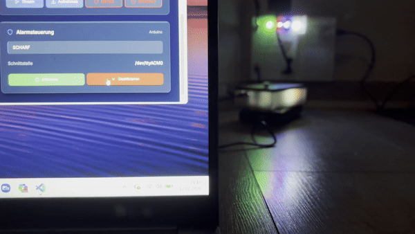
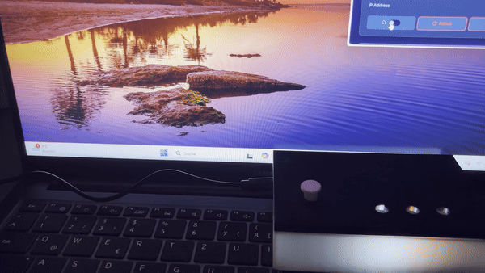

<a id="top"></a>

<div align="center">

[](#deutsch)
[](#english)

</div>

---

<a id="de-demos"></a>
<a id="en-demos"></a>

<div align="center">
  <a href="#">
   
  </a>
  &nbsp;&nbsp;&nbsp;&nbsp;&nbsp;&nbsp;
  <a href="#">
    
  </a>
  &nbsp;&nbsp;&nbsp;&nbsp;&nbsp;&nbsp;
 <a href="#">
    
  </a>
</div>

---

<a id="deutsch"></a>

<a id="iot-alarmanlage"></a>

# IoT-Alarmanlage

Die IoT-Alarmanlage basiert auf einem `Elegoo Uno R3`, zwei `ESP8266` und einem `Raspberry Pi Zero 2 W`. RFID und zwei Reed-Sensoren steuern die lokale Alarm-FSM. Ein Funkpfad uebertraegt Alarmzustaende an den Empfaenger; das Dashboard zeigt Telemetrie, Logs und Aufnahmen und sendet freigegebene Befehle.

Dieses Projekt entstand in meinem ersten Studiensemester und war mein erstes Lernprojekt.

```text
RFID + 2x Reed -> Uno-FSM -> UART -> ESP-Sender -> HMAC-UDP -> ESP-Empfaenger
                         |
                         +-> USB-Serial <-> Alarm-Monitor <-> lokale IPC <-> Dashboard

ESP-Sender + ESP-Empfaenger <-> HTTP/JSON im isolierten IoT-WLAN <-> Raspberry Pi / PHP-API
```

<a id="de-aktueller-stand"></a>

## Aktueller Stand

| Ziel | Aktiver Sketch |
|---|---|
| Uno R3 | `firmware/elegoo_uno_r3/sketchR3/alarm_system/alarm_system.ino` |
| ESP-Sender | `firmware/esp8266/sender/sender.ino` |
| ESP-Empfaenger | `firmware/esp8266/receiver/receiver.ino` |

- Der Uno akzeptiert ohne private `uid_whitelist.local.h` keine Karte. Scharf-/Alarmzustand liegt CRC-geschuetzt in zwei EEPROM-Slots; ein offener Reed-Kreis loest scharf Alarm aus.
- UDP nutzt HMAC-SHA256, strikt monotone persistente Sequenzen und signierte ACKs. HTTP-Zustellungen nutzen getrennte Geraete-Token/-HMACs und ein durables `ALARMv2`-Apply-Journal.
- `nginx`/`PHP-FPM` bedienen den Browser per HTTPS und die ESPs ueber einen auf das IoT-WLAN beschraenkten HTTP-Endpunkt. Der Dienst `iot-alarm-monitor` besitzt exklusiv Serial, Recorder und deren Loeschpfade.
- Der Prototyp besitzt keine formale Produkt-, Safety- oder Security-Freigabe.

<a id="de-repository"></a>

## Repository

| Pfad | Inhalt |
|---|---|
| `firmware/` | drei aktive Arduino-Ziele |
| `web/` | Dashboard, API, Monitor und Deploy-Vorlagen |
| `hardware/` | KiCad-, Gerber- und Aufbauquellen |
| `mechanics/` | STL-Dateien und Vorschauen |
| `media/` | Projektfotos und fuenf Demo-GIFs |
| `docs/`, `tests/` | kanonische Dokumentation und Nachweise |

<a id="de-einstieg"></a>

## Einstieg

[Build](docs/BUILD.md#deutsch) · [Hardware](docs/HARDWARE.md#deutsch) · [Web-Dashboard](web/README.md#deutsch) · [Tests](docs/TESTING.md#deutsch) · [Safety](SAFETY.md#deutsch) · [Security](SECURITY.md#deutsch)

<a id="de-sicherheitsgrenze"></a>

## Sicherheitsgrenze

Das System ist ein nicht zertifizierter Lernprototyp. Ausfaelle von Strom, Funk, Speicher, Kamera oder Hardware koennen seine Funktion beeintraechtigen.

<a id="de-lokale-konfiguration"></a>

## Lokale Konfiguration

RFID-UIDs, WLAN-Daten, Token, HMAC-Secrets, Passwoerter, PINs und Laufzeitdaten bleiben lokal. Vorlagen enden auf `.example`; private Werte liegen in ignorierten `*.local.*`-Dateien oder im geschuetzten `web/data/`.

<a id="de-lizenz"></a>

## Lizenz

Projekt-eigene Inhalte stehen unter der [MIT-Lizenz](LICENSE.md); Drittmaterial behaelt seine jeweiligen Rechte.

<div align="center">

[](#top)

</div>

---

<a id="english"></a>

<a id="iot-alarm-system"></a>

# IoT Alarm System

The IoT alarm system uses an `Elegoo Uno R3`, two `ESP8266` nodes, and a `Raspberry Pi Zero 2 W`. RFID and two reed sensors drive the local alarm FSM. A radio link sends alarm states to the receiver; the dashboard displays telemetry, logs, and recordings and sends approved commands.

This project began during the first semester of my degree and was my first learning project.

```text
RFID + 2x reed -> Uno FSM -> UART -> ESP sender -> HMAC UDP -> ESP receiver
                           |
                           +-> USB serial <-> alarm monitor <-> local IPC <-> dashboard

ESP sender + ESP receiver <-> HTTP/JSON on the isolated IoT WiFi <-> Raspberry Pi / PHP API
```

<a id="en-current-status"></a>

## Current Status

| Target | Active sketch |
|---|---|
| Uno R3 | `firmware/elegoo_uno_r3/sketchR3/alarm_system/alarm_system.ino` |
| ESP sender | `firmware/esp8266/sender/sender.ino` |
| ESP receiver | `firmware/esp8266/receiver/receiver.ino` |

- Without private `uid_whitelist.local.h`, the Uno accepts no card. Armed/alarm state is CRC-protected across two EEPROM slots; either open reed circuit triggers an armed system.
- UDP uses HMAC-SHA256, strict monotonic persistent sequences, and signed ACKs. HTTP delivery uses separate device tokens/HMACs and a durable `ALARMv2` apply journal.
- `nginx`/`PHP-FPM` serve the browser over HTTPS and the ESPs through an HTTP endpoint restricted to the IoT WiFi. The `iot-alarm-monitor` service exclusively owns serial, the recorder, and their deletion paths.
- The prototype has no formal product, safety, or security approval.

<a id="en-repository"></a>

## Repository

| Path | Contents |
|---|---|
| `firmware/` | three active Arduino targets |
| `web/` | dashboard, API, monitor, and deployment templates |
| `hardware/` | KiCad, Gerber, and assembly sources |
| `mechanics/` | STL files and previews |
| `media/` | project photos and five demo GIFs |
| `docs/`, `tests/` | canonical documentation and evidence |

<a id="en-getting-started"></a>

## Getting Started

[Build](docs/BUILD.md#english) · [Hardware](docs/HARDWARE.md#english) · [Web dashboard](web/README.md#english) · [Tests](docs/TESTING.md#english) · [Safety](SAFETY.md#english) · [Security](SECURITY.md#english)

<a id="en-security-boundary"></a>

## Security Boundary

The system is an uncertified learning prototype. Power, radio, storage, camera, or hardware failures may impair its operation.

<a id="en-local-configuration"></a>

## Local Configuration

RFID UIDs, WiFi credentials, tokens, HMAC secrets, passwords, PINs, and runtime data remain local. Templates end in `.example`; private values live in ignored `*.local.*` files or protected `web/data/`.

<a id="en-license"></a>

## License

Project-owned content uses the [MIT License](LICENSE.md); third-party material retains its respective rights.

<div align="center">

[](#top)

</div>
