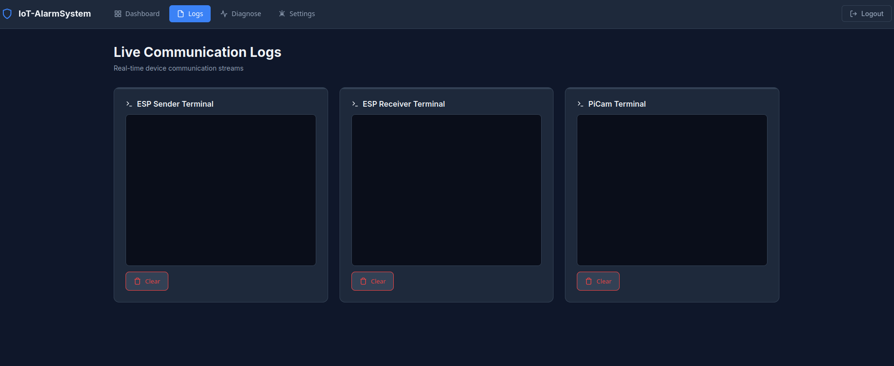
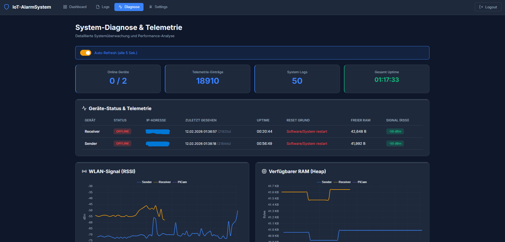

<a id="top"></a>

<div align="center">

[](#deutsch)
[](#english)

</div>

---

<a id="deutsch"></a>

<a id="de-dashboard"></a>

# Web-Dashboard

Die leichtgewichtige PHP-Anwendung fuer den Raspberry Pi Zero 2 W verwendet JSON-/CSV-Dateien statt einer Datenbank. Sie verbindet ESP-Telemetrie und -Kommandos, den Uno ueber einen dedizierten Serial-Dienst sowie optionale Kamera-Streams und Alarmaufnahmen.

<a id="de-ansichten"></a>

## Ansichten






<a id="de-architektur"></a>

## Architektur

| Pfad | Aufgabe |
|---|---|
| `index.php`, `login.php` | geschuetzte Oberflaeche und Login |
| `api.php` | Dashboard-Aktionen und ESP-Endpunkt |
| `stream.php` | authentifizierte Kameraansicht |
| `includes/` | Konfiguration, Authentifizierung und Datenzugriff |
| `views/`, `css/`, `js/` | statische Oberflaeche |
| `alarm_monitor.py` | alleiniger Serial-, Recorder- und Loeschprozess |
| `alarm_monitor.service` | gehaertete systemd-Unit |
| `deploy/` | nginx-, Fail2ban- und systemd-Vorlagen |
| `data/` | ignorierter lokaler Laufzeitzustand |

Browserzugriff erreicht nginx ausschliesslich ueber HTTPS; Port 80 leitet auf den festen HTTPS-Namen um. Ein separater HTTP-Listener bindet die IP-Adresse des Pi im IoT-WLAN, erlaubt nur dessen isoliertes Subnetz und stellt dort ausschliesslich `api.php` bereit. Interne Verzeichnisse und Dateitypen werden nicht statisch ausgeliefert.

PHP oeffnet weder Serial noch ffmpeg. Freigegebene Aktionen gehen ueber den
lokalen Socket `/run/iot-alarm-monitor/control.sock` an den Dienst; nur dieser
Prozess besitzt `dialout`, Recorder und Aufnahme-Loeschpfad.

<a id="de-funktionen"></a>

## Funktionen

- Live-Status, RSSI, Heap, Uptime und Resetgrund beider ESPs
- Kommunikations-, System- und Auditlogs sowie Telemetrie-CSV
- Auditansicht/-export mit fuenf Minuten gueltiger serverseitiger PIN-Freigabe
- PIN-Schutz fuer Alarm, Reboot, Datenreset und Aufnahmeaktionen
- getrennte Node-Kommandos und -Konfigurationen mit Geraete-ACK
- Admin-Passwort, Alarm-PIN, Session-Timeout und Aktualisierungsintervall
- optionale MJPEG-Ansicht sowie automatische und manuelle Aufnahmen

Google Fonts, `unpkg.com` und `jsDelivr` bleiben externe Browserabhaengigkeiten.
Ohne Internet funktionieren die Serverpfade weiter; Icons, Schrift oder Charts
koennen fehlen. Die Grenze ist in [Security](../SECURITY.md#deutsch) bewertet.

<a id="de-ersteinrichtung"></a>

## Ersteinrichtung

Eine neue Installation erzeugt Admin-Passwort, Alarm-PIN, getrennte API-/Delivery-Secrets fuer Sender, Empfaenger und Kamera sowie ein eigenes UDP-Secret. Es gibt keine bekannten Standardzugangsdaten.

1. Deployment nach [Build](../docs/BUILD.md#de-web-deployment) installieren.
2. Dashboard ueber HTTPS aufrufen und Bootstrap-Datei lokal lesen.
3. Admin-Passwort und Alarm-PIN ersetzen.
4. Jeden ESP mit seinem eigenen API-/Delivery-Paar und dem gemeinsamen
   UDP-Secret provisionieren.
5. Bootstrap-Datei sicher loeschen.

<a id="de-alarm-monitor"></a>

## <a id="de-betrieb"></a>Alarm-Monitor und Betrieb

Der Dienst akzeptiert Serial nur nach einem gueltigen `STATUS`-Handshake,
gleicht den Zustand periodisch ab und bestaetigt Scharf-/Unscharf-Befehle erst
nach passendem Snapshot. Bei Verbindungsverlust bleibt ein Alarm konservativ
erhalten. Aufnahmen besitzen Zeit-, Groessen- und Speichergrenzen, begrenzte
Start-Retries und Schutz vor dem Loeschen der aktiven Datei. `log.txt` rotiert;
PHP schreibt getrennt nach `api.log`. Die aktuellen Grenzwerte stehen in der
[Dienstvorlage](deploy/systemd/iot-alarm-monitor.env.example).

```bash
sudo nginx -t
sudo systemctl status nginx php8.4-fpm iot-alarm-monitor.service
sudo journalctl -u iot-alarm-monitor.service -f
sudo ls -l /run/iot-alarm-monitor/control.sock
sudo fail2ban-client status iot-login
```

Runtime-Dateien nie committen oder oeffentlich weitergeben; ihr Manifest
steht in [data/README.md](data/README.md#deutsch). Der ESP-HTTP-Endpunkt darf
nicht aus WAN, Gast-, Campus- oder anderen unkontrollierten Netzen erreichbar
sein.

<div align="center">

[](#top)

</div>

---

<a id="english"></a>

<a id="en-dashboard"></a>

# Web Dashboard

This lightweight PHP application for the Raspberry Pi Zero 2 W uses JSON/CSV files instead of a database. It combines ESP telemetry and commands, Uno control through a dedicated serial service, and optional camera streams and alarm recordings.

<a id="en-views"></a>

## Views


<a id="en-architecture"></a>

## Architecture

| Path | Purpose |
|---|---|
| `index.php`, `login.php` | protected interface and login |
| `api.php` | dashboard actions and ESP endpoint |
| `stream.php` | authenticated camera view |
| `includes/` | configuration, authentication, and data access |
| `views/`, `css/`, `js/` | static interface |
| `alarm_monitor.py` | sole serial, recorder, and deletion process |
| `alarm_monitor.service` | hardened systemd unit |
| `deploy/` | nginx, Fail2ban, and systemd templates |
| `data/` | ignored local runtime state |

Browser access reaches nginx only over HTTPS; port 80 redirects to the fixed HTTPS name. A separate HTTP listener binds the Pi address on the IoT WiFi, permits only that isolated subnet, and exposes only `api.php`. Internal directories and file types are never served statically.

PHP opens neither serial nor ffmpeg. Approved actions reach the service over
the local `/run/iot-alarm-monitor/control.sock` socket; only that process owns
`dialout`, the recorder, and recording deletion.

<a id="en-features"></a>

## Features

- live status, RSSI, heap, uptime, and reset reason for both ESPs
- communication, system, and audit logs plus telemetry CSV
- audit view/export with a five-minute server-side PIN grant
- PIN protection for alarm, reboot, data reset, and recording actions
- separate node commands and configurations with device ACKs
- admin password, alarm PIN, session timeout, and refresh interval
- optional MJPEG view plus automatic and manual recordings

Google Fonts, `unpkg.com`, and `jsDelivr` remain external browser dependencies.
Server paths keep working offline, but icons, fonts, or charts may be missing.
This boundary is assessed in [Security](../SECURITY.md#english).

<a id="en-first-setup"></a>

## First-Time Setup

A new installation creates an admin password, alarm PIN, separate API/delivery
secrets for sender, receiver, and camera, plus a separate UDP secret. There are
no known default credentials.

1. Install the deployment from [Build](../docs/BUILD.md#en-web-deployment).
2. Open the dashboard over HTTPS and read the bootstrap file locally.
3. Replace the admin password and alarm PIN.
4. Provision each ESP with its own API/delivery pair and the shared UDP secret.
5. Securely delete the bootstrap file.

<a id="en-alarm-monitor"></a>

## <a id="en-operation"></a>Alarm Monitor and Operation

The service accepts serial only after a valid `STATUS` handshake, periodically
reconciles state, and confirms arm/disarm only after a matching snapshot. It
conservatively retains an alarm on connection loss. Recordings have time,
size, and free-space limits, bounded start retries, and active-file deletion
protection. `log.txt` rotates; PHP writes separately to `api.log`. Current
limits live in the [service template](deploy/systemd/iot-alarm-monitor.env.example).

```bash
sudo nginx -t
sudo systemctl status nginx php8.4-fpm iot-alarm-monitor.service
sudo journalctl -u iot-alarm-monitor.service -f
sudo ls -l /run/iot-alarm-monitor/control.sock
sudo fail2ban-client status iot-login
```

Never commit or publicly share runtime files; see their manifest
in [data/README.md](data/README.md#english). The ESP HTTP endpoint must not be
reachable from WAN, guest, campus, or other untrusted networks.

<div align="center">

[](#top)

</div>
