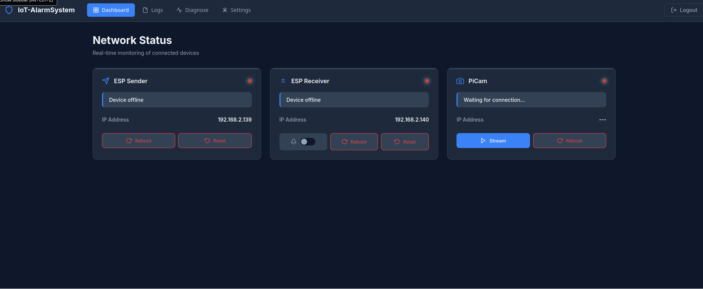
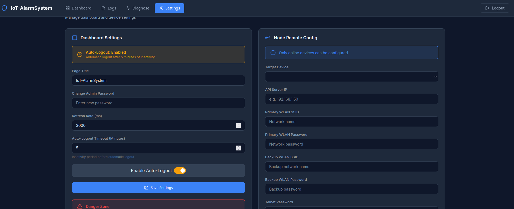
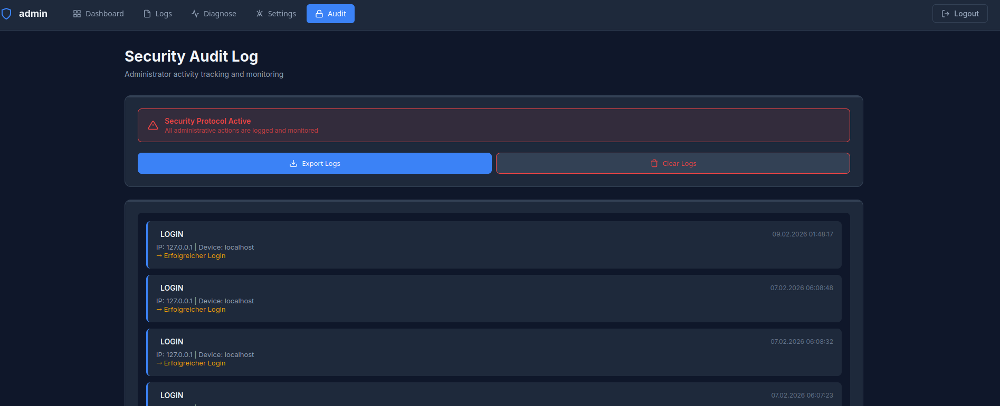

# Web Dashboard & Monitoring Interface

[](https://www.raspberrypi.com/) [](https://dietpi.com/) [](https://www.php.net/) [](https://www.lighttpd.net/) [](https://developer.mozilla.org/en-US/docs/Web/JavaScript)

**Übersicht / Overview** Das Web-Dashboard ist die zentrale Steuerungs- und Überwachungseinheit der IoT-Alarmanlage. Es wurde speziell für ressourcenbeschränkte Hardware (Raspberry Pi Zero 2 W) optimiert und bietet eine responsive, moderne Benutzeroberfläche ohne schwere Framework-Abhängigkeiten.

The web dashboard serves as the central control and monitoring unit of the IoT alarm system. It is optimized for resource-constrained hardware (Raspberry Pi Zero 2 W) and offers a responsive, modern user interface without heavy framework dependencies.

---

## Galerie / Gallery

Hier einige Eindrücke der Benutzeroberfläche.  

Here are some impressions of the user interface.


<div align="center">
  
  <br>
  <em>Hauptansicht Dashboard / Main Dashboard View</em>
  <br><br>

  
  <br>
  <em>Logs & Einstellungen / Logs & Settings</em>
  <br><br>

  
  <br>
  <em>Sicherheits-Audit-Log / Security Audit Log</em>
</div>

---

## Technischer Stack / Technical Stack

| Komponente / Component | Technologie / Technology | Beschreibung / Description |
|------------------------|-------------------------|----------------------------|
| **Hardware** | Raspberry Pi Zero 2 W | ARM Cortex-A53, 512MB RAM, WiFi/Bluetooth 4.2 BLE |
| **OS** | DietPi (Debian Bookworm) | Extrem leichtgewichtiges, optimiertes Linux |
| **Webserver** | Lighttpd 1.4.76 | Performance-orientierter Webserver mit FastCGI |
| **Backend** | PHP 8.4.16 | API-Logik, Session-Management & File-I/O |
| **Frontend** | HTML5, CSS3, JS | "Vanilla" Stack für max. Performance (kein React/Vue) |
| **Visualisierung** | Chart.js | Rendering der Live-Telemetrie (Canvas-basiert) |
| **Design** | CSS Grid & Glassmorphism | Custom Design System, Icons via Lucide |

---

## Architektur & Design / Architecture & Design


### Backend-Architektur / Backend Architecture
Das System verzichtet bewusst auf eine SQL-Datenbank, um Schreibzyklen auf der SD-Karte zu minimieren und die Latenz gering zu halten.  

The system deliberately avoids an SQL database to minimize write cycles on the SD card and keep latency low.

* **Core-Komponenten / Core Components:**
    * `index.php`: Rendert das Dashboard und verwaltet die Session-Sicherheit.  
      Renders the dashboard and manages session security.
    * `api.php`: Zentraler RESTful Endpoint für alle AJAX-Requests und ESP-Kommunikation.  
      Central RESTful endpoint for all AJAX requests and ESP communication.

* **Datenspeicherung / Data Storage:** JSON-Flatfiles im Ordner `/data/` dienen als persistenter Speicher für Logs und Konfigurationen.  
  JSON flat files in the `/data/` folder serve as persistent storage for logs and configurations.

* **Sicherheit / Security:** Session-Hijacking-Prävention durch IP-Bindung und Activity-Tracking.  
  Session hijacking prevention via IP binding and activity tracking.

### Frontend-Design
* **Performance First:** Verzicht auf Bootstrap oder Tailwind zugunsten von handoptimiertem CSS.  
  Avoidance of Bootstrap or Tailwind in favor of hand-optimized CSS.

* **UX:** Responsive Grid-Layout, das sich automatisch an Smartphones, Tablets und Desktops anpasst.  
  Responsive grid layout that automatically adapts to smartphones, tablets, and desktops.

* **Visueller Stil / Visual Style:** Modernes "Glassmorphism"-Design mit halbtransparenten Elementen und Unschärfe-Effekten.  
  Modern "Glassmorphism" design with semi-transparent elements and blur effects.

---

## Installation & Setup

Voraussetzung ist ein eingerichteter Raspberry Pi (empfohlen: DietPi oder Raspberry Pi OS Lite).  

Prerequisites: A set-up Raspberry Pi (recommended: DietPi or Raspberry Pi OS Lite).

```bash
# System aktualisieren / Update system
sudo apt update && sudo apt upgrade -y

# Webserver und PHP-FPM installieren / Install Webserver & PHP
# Hinweis: Version kann je nach Repo variieren (z.B. php8.2-fpm)
sudo apt install lighttpd php8.2-fpm -y

# FastCGI-PHP Modul aktivieren / Enable FastCGI module
sudo lighttpd-enable-mod fastcgi-php

# Dienst neu starten / Restart service
sudo systemctl restart lighttpd

# Dashboard-Dateien in das Webroot kopieren / Copy dashboard files to webroot
# Passe den Quellpfad an deinen lokalen Pfad an / Adjust source path
sudo cp -r embedded/private/web/* /var/www/html/

# WICHTIG: Berechtigungen setzen / IMPORTANT: Set permissions
sudo chown -R www-data:www-data /var/www/html/

# Daten-Verzeichnis erstellen und Schreibrechte geben / Create data dir & set write permissions
sudo mkdir -p /var/www/html/data
sudo chmod 775 /var/www/html/data
```

## Performance & Wartung / Performance & Maintenance

Das System ist wartungsarm ausgelegt. Über das Admin-Panel stehen folgende Werkzeuge zur Verfügung:

The system is designed for low maintenance. The following tools are available via the Admin Panel:


### Dashboard-Funktionen
- **Telemetrie-Export:** Download der RSSI- und Heap-Daten als `.csv`.  
Download RSSI/Heap data
- **Audit-Logs:** Export der Sicherheits-Logs (Wer hat wann was geschaltet?).  
Export security logs
- **System-Reset:** Bereinigt alle temporären Daten (behält Audit-Logs).  
Clears temp data, keeps audit logs
- **Log-Management:** Gezieltes Löschen einzelner Log-Kategorien (UART, System, API).  
Targeted log deletion

## System-Monitoring (Terminal)

Für tiefergehende Diagnosen direkt auf dem Pi:  

For deeper diagnostics directly on the Pi:

```bash
# Temperatur überwachen / Monitor temperature
vcgencmd measure_temp

# Webserver-Logs (Zugriffe & Fehler) / Webserver logs (Access & Errors)
tail -f /var/log/lighttpd/error.log

# PHP-Fehlerprotokoll / PHP Error Log
tail -f /var/log/php8.2-fpm.log
```


[Zurück zur Haupt-Dokumentation / Back to main dokumentation](../README.md)